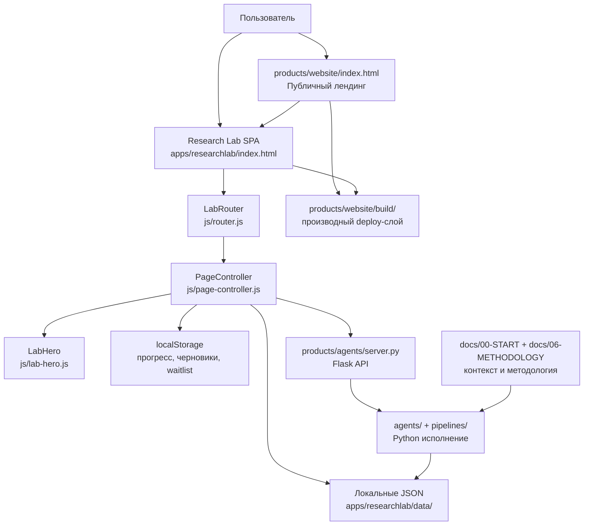

# Карта связей проекта «Голем»

**Файл:** `docs/01-ARCHITECTURE/GRAPH.md`
**Статус:** актуальная схема границ
**Опора:** `docs/01-ARCHITECTURE/ARCHITECTURE.md`

## Слои



## Research Lab: жизненный цикл маршрута

```text
location.hash
    ↓
LabRouter.parseHash()
    ↓
LabRouter.showModule()
    ↓
PageController.render(moduleId, container, parsed)
    ↓
профильный renderer модуля
    ↓
LabHero.setView() + renderBreadcrumbs()
    ↓
локальный JSON или products/agents/server.py
```

## Основные границы

- `docs/` объясняет систему и задаёт методологические ограничения.
- `products/website/index.html` — публичная точка входа, не Research Lab renderer.
- `products/website/apps/researchlab/` — статический SPA-интерфейс инструментов.
- `products/agents/` — серверное выполнение пайплайнов и API.
- `localStorage` — локальное состояние пользователя; не серверная база.
- `build/` — результат сборки; править только исходники.
- `archive/` — исторический контекст, не активная зависимость.

## Ключевые маршруты Research Lab

- `#dashboard` — рабочий стол.
- `#root-dictionary` — корневой словарь.
- `#learn/paleo-trainer` — палео-тренажёр.
- `#pipelines` — список пайплайнов.
- `#pipelines/<id>` — detail-страница пайплайна и результата.
- `#workbench` — мастерская.
- `#workbench/run/<id>` — запуск пайплайна.
- `#workbench/project/<id>` — проект и история результата.

## Данные и fallback

- Словари, корни, буквы, методология и корпус загружаются из `apps/researchlab/data/`.
- Пайплайны читаются из `data/pipelines.json`.
- Результаты читаются из API, затем из локального `data/pipeline-results.json`.
- При недоступном агентном сервере локальные экраны должны продолжать работать.
- Waitlist публичного лендинга использует Supabase только при наличии клиента; иначе — `localStorage.golem_waitlist`.

## Обновление схемы

При изменении структуры сначала обновить `ARCHITECTURE.md`, затем эту карту. Не восстанавливать старые узлы `instructions/`, `tools/checkers/`, `LabRenderer` и другие исторические слои без фактического кода.