# 🗺 ВИЗУАЛЬНАЯ КАРТА СВЯЗЕЙ

**Метаданные файла**
- **Файл:** `docs/GRAPH.md`
- **Версия:** 1.0
- **Дата создания:** 2026-06-09
- **Статус:** Активный
- **Тема:** Визуальная карта связей между файлами проекта

---

## 📊 ДИАГРАММА СВЯЗЕЙ

```mermaid
graph TD
  subgraph instructions
    instructions_chat_prompt_md["CHAT-PROMPT — ШАБЛОН ДЛЯ НОВОГО ЧАТА"]
    instructions_checkers_bdikah_checker_md["בְּדִיקָה — BDIKAH-CHECKER: ПРОВЕРКА ТЕКСТА НА РЕЛИГИОНИЗМЫ"]
    instructions_checkers_consistency_checker_md["✅ ЧЕКЕР СОГЛАСОВАННОСТИ (CONSISTENCY CHECKER)"]
    instructions_checkers_factcheck_md["בְּדִיקַת עֻבְדּוֹת — FACTCHECKER: ПРОВЕРКА ФАКТОВ"]
    instructions_checkers_mivdak_md["מִבְדָּק — MIVDAK: АУДИТ ПОЛЕЗНОСТИ ТЕКСТА"]
    instructions_checkers_startup_checklist_md["✅ ЧЕК-ЛИСТ ЗАГРУЗКИ ФАЙЛОВ ДЛЯ НАСТРОЙКИ НЕЙРОСЕТИ"]
    instructions_checkers_tikun_fix_md["תִּקּוּן — TIKUN-FIX: ШАБЛОН ЗАДАЧ ПО ОБНОВЛЕНИЮ"]
    instructions_coding_standards_md["СТАНДАРТЫ КОДА (CODING STANDARDS)"]
    instructions_collaboration_guide_md["🤝 РУКОВОДСТВО ДЛЯ КОНТРИБЬЮТОРОВ (COLLABORATION GUIDE)"]
    instructions_exposure_exposure_distortions_md["סוּגֵי עִיוּת — ТИПЫ ИСКАЖЕНИЙ И ИХ ПРИЁМЫ"]
    instructions_exposure_exposure_language_control_md["שְׁלִיטַת הַלָּשׁוֹן — ЯЗЫК КАК ИНСТРУМЕНТ КОНТРОЛЯ"]
    instructions_exposure_exposure_mechanisms_md["מַנְגְּנוֹנֵי חֲשִׂיפָה — МЕХАНИЗМЫ ПОДМЕНЫ"]
    instructions_exposure_exposure_methods_md["שִׁיטוֹת חֲשִׂיפָה — МЕТОДЫ РАЗОБЛАЧЕНИЯ"]
    instructions_exposure_exposure_principles_md["עֶקְרוֹנוֹת חֲשִׂיפָה — ОСНОВНЫЕ ПРИНЦИПЫ РАЗОБЛАЧЕНИЯ"]
    instructions_exposure_exposure_system_architecture_md["אַדְרִיכָלוּת הַמַּעֲרֶכֶת — АРХИТЕКТУРА СИСТЕМЫ"]
    instructions_exposure_exposure_techniques_md["תַּכְסִיסֵי חֲשִׂיפָה — ПРИЁМЫ ПОДМЕНЫ: ПОЛНЫЙ КАТАЛОГ"]
    instructions_exposure_exposure_theory_religionism_md["ТЕОРИЯ РЕЛИГИОНИЗМОВ — ПОЛНОЕ РАЗОБЛАЧЕНИЕ"]
    instructions_forbidden_words_md["מַפַּת מִלִּים אֲסוּרוֹת — КАРТА ЗАПРЕЩЁННЫХ СЛОВ"]
    instructions_image_map_md["תַּבְנִית מַפַּת דִּמּוּיִם — ШАБЛОН КАРТЫ ОБРАЗОВ"]
    instructions_images_catalogue_md["דִּמּוּיִם — ОБРАЗЫ ТАНАХА И БАШАХА"]
    instructions_manifest_md["מִנְשָׁר — МАНИФЕСТ ВОССТАНОВЛЕНИЯ"]
    instructions_methodology_archeology_methodology_md["אַרְכֵאוֹלוֹגְיָה שֶׁל מַשְׁמָעֻיּוֹת — АРХЕОЛОГИЯ СМЫСЛОВ"]
    instructions_methodology_hebrew_reconstruction_md["שִׁחְזוּר בְּשׂוֹרַת יֵשׁוּעַ — ВОССТАНОВЛЕНИЕ ИВРИТСКОГО ОР"]
    instructions_methodology_translation_methodology_md["ПЕРЕВОДЧЕСКАЯ МЕТОДОЛОГИЯ"]
    instructions_methodology_transliteration_distortions_md["תַּרְגּוּמֵי שֶׁקֶר — КЛЮЧЕВЫЕ ТРАНСЛИТЕРАЦИИ, ИСКАЖАЮЩИЕ СМ"]
    instructions_methodology_tree_method_md["שִׁיטַת הָעֵץ — МЕТОД ДЕРЕВА: КАК ПРОВЕРЯТЬ УЧЕНИЕ"]
    instructions_release_process_md["📦 ПРОЦЕСС ВЫПУСКА ВЕРСИЙ (RELEASE PROCESS)"]
    instructions_research_principles_md["עֶקְרוֹנוֹת — ПРИНЦИПЫ ИССЛЕДОВАНИЙ"]
    instructions_retrospective_md["רֶטְרוֹסְפֶּקְטִיבָה — РЕТРОСПЕКТИВА: ИТОГИ И УЛУЧШЕНИЯ"]
    instructions_security_policy_md["🔒 ПОЛИТИКА БЕЗОПАСНОСТИ (SECURITY POLICY)"]
  end
  subgraph researches
    researches_archive_allopaty_md["אָלוֹפַּתְיָה — АЛЛОПАТИЯ: ЛЕЧЕНИЕ СИМПТОМОВ ИЛИ Рефуа ЦЕЛОС"]
    researches_archive_caduceus_control_md["🐍 КАДУЦЕЙ: ЗМЕИ, ПОЗВОНОЧНИК И КОНТРОЛЬ"]
    researches_archive_g_generations_md["דּוֹרוֹת רֶשֶׁת — G-СВЯЗИ И КАТАСТРОФЫ: СОВПАДЕНИЕ ИЛИ АРХИТ"]
    researches_archive_gerewol_md["גֶּרֶווֹל — GEREWOL: Авода Бриа ВМЕСТО ТВОРЦА"]
    researches_archive_hygieia_md["גֵהְיָה — ЧАША ГИГИЕИ: От Рефуа ИЛИ КУЛЬТ НАРОДОВ?"]
    researches_archive_microplastics_md["מִיקְרוֹפְּלַסְטִיק — МИКРОПЛАСТИК: НЕВИДИМОЕ ЗАГРЯЗНЕНИЕ"]
    researches_archive_new_year_md["רֹאשׁ הַשָּׁנָה הַשִּׁקְרִי — НОВЫЙ ГОД: РИМСКИЙ КУЛЬТ ЯНУСА"]
    researches_archive_paracelsus_md["פָּרַצֵלְסוּס — ПАРАЦЕЛЬС: АЛХИМИК, ПЕРЕВОРОТЧИК, ЦЕЛИТЕЛЬ"]
    researches_archive_pedophilia_md["תּוֹעֵבָה — ПЕДОФИЛИЯ: МЕДИЦИНСКИЙ Мунах ИЛИ ТОЭВА?"]
    researches_archive_pornography_md["זָנָה — ПОРНОГРАФИЯ: ПРОДАЖА ОТДЕЛЁННОСТИ ЗА Таава"]
    researches_archive_psychology_md["פְּסִיכוֹלוֹגְיָה — ПСИХОЛОГИЯ: ПСЮХЕ ПРОТИВ НЭФЕШ"]
    researches_archive_pyramid_bunker_md["פִּירָמִידָה — ПИРАМИДА: ГРОБНИЦА ИЛИ БУНКЕР?"]
    researches_archive_rock_mantras_md["rock-mantras"]
    researches_archive_slavs_md["סְלָבִים — СЛАВЯНЕ: ЛЮДИ СЛОВА"]
    researches_books_analiz_poryadka_genri_md["סֵדֶר עוֹלָמִי — МИРОВОЙ ПОРЯДОК: КИССИНДЖЕР И Мемшала ХАОСО"]
    researches_books_machiavelli_the_prince_md["הַנָּסִיךְ — ГОСУДАРЬ: МАКИАВЕЛЛИ И ВЛАСТЬ БЕЗ ЯХВЕ"]
    researches_companies_amazon_md["אָמָזוֹן — AMAZON: ТОРГОВЛЯ БЕЗ ЛИЦА"]
    researches_companies_blackrock_md["בְּלַקְרוֹק — BLACKROCK: ЧЁРНАЯ СКАЛА МИРОВОЙ ВЛАСТИ"]
    researches_companies_goldman_sachs_md["גּוֹלְדְמַן זַקְס — GOLDMAN SACHS: ДЕНЬГИ КАК ВЛАСТЬ"]
    researches_companies_google_md["גּוּגֶל — GOOGLE: ОРАКУЛ СИСТЕМЫ"]
    researches_companies_ibm_md["י.ב.מ. — IBM: МАШИНА УЧЁТА И КОНТРОЛЯ"]
    researches_companies_jpmorgan_md["גֵ'יי.פִּי.מוֹרְגָן — JPMORGAN CHASE: ИМПЕРИЯ КРЕДИТА И КОНТ"]
    researches_companies_meta_md["מֶטָא — META: ЦИФРОВОЙ ВАВИЛОН"]
    researches_companies_neuralink_md["נֵיירָלִינְק — NEURALINK: ЧИП В МОЗГ КАК ПЕЧАТЬ ЗВЕРЯ"]
    researches_companies_palantir_md["פַּלַנְטִיר — PALANTIR: ВИДЯЩИЙ КАМЕНЬ СИСТЕМЫ"]
    researches_companies_vanguard_md["וַנְגַּארְד — VANGUARD: НЕВИДИМАЯ РУКА РЫНКА"]
    researches_economy_banks_and_financial_dynasties_md["БАНКИ И ФИНАНСОВЫЕ ДИНАСТИИ — АРХИТЕКТУРА ГЛОБАЛЬНОГО КОНТРО"]
    researches_economy_gambling_vs_life_md["קוּבְּיָה אוֹ חַיִּים — ИГРАТЬ ИЛИ ЖИТЬ?"]
    researches_economy_money_symbols_md["💱 РУБЛЬ, ЕВРО, ДОЛЛАР: ЯЗЫЧЕСКИЕ ЗНАКИ НА ДЕНЬГАХ"]
    researches_economy_mortgage_dead_pledge_md["ИПОТЕКА — МЕРТВЫЙ ЗАЛОГ НА ЖИЗНЬ"]
  end
  subgraph terminology
    terminology_ahava_md["АГАПЭ (AHАVA) — Аhава"]
    terminology_arum_md["עָרוּם — АРУМ: ХИТРЫЙ, ПРОНИЦАТЕЛЬНЫЙ"]
    terminology_arur_md["אָרוּר — АРУР: Арур КАК ОГРАНИЧЕНИЕ, А НЕ МЕСТЬ"]
    terminology_asur_md["אָסוּר — АСУР: СВЯЗАННЫЙ, ОГРАНИЧЕННЫЙ, В ОКОВАХ"]
    terminology_avar_atid_md["עָבַר וְעָתִיד — АВАР И АТИД: СБЫВШЕЕСЯ И НЕСБЫВШЕЕСЯ"]
    terminology_avodah_zarah_md["עֲבוֹדָה זָרָה — АВОДА ЗАРА: ЧУЖАЯ СЛУЖБА"]
    terminology_avon_md["עָוֹן (АВОН) — ИСКРИВЛЕНИЕ, А НЕ «БЕЗЗАКОНИЕ»"]
    terminology_barach_md["בָּרַח (БАРАХ) — БЕГСТВО К YHWH, А НЕ «ПОБЕГ ОТ МИРА»"]
    terminology_bavel_md["בָּבֶל — БАВЭЛЬ: Ирбув, КОТОРОЕ НАЗЫВАЕТ СЕБЯ ПОРЯДКОМ"]
    terminology_bayit_md["בַּיִת (БАЙТ) — ДОМ, А НЕ «ХРАМ»"]
    terminology_beit_ha_mikdash_md["בֵּית הַמִּקְדָּשׁ — БЕЙТ hА-МИКДАШ: ДОМ ОТДЕЛЁННОСТИ"]
    terminology_brit_md["בְּרִית (БРИТ) — Брит, А НЕ «ЗАВЕТ»"]
    terminology_chamas_md["חָמָס (ХАМАС) — НАСИЛИЕ, А НЕ ПРОСТО «ГРЕХ»"]
    terminology_cherut_md["חֵרוּת — ХЕРУТ: Хофеш ДЛЯ ВЕРНОСТИ"]
    terminology_chesed_md["חֶסֶד (ХЕСЕД) — ПРЕДАННАЯ Аhава, А НЕ «МИЛОСТЬ» И НЕ «БЛАГОД"]
    terminology_derech_apayim_md["אֶרֶךְ אַפַּיִם — ЭРЕХ АПАЙИМ: ДОЛГОЕ ДЫХАНИЕ ВМЕСТО ТЕРПЕНИ"]
    terminology_derech_md["דֶּרֶךְ (ДЕРЕХ) — Дэрех, А НЕ «РЕЛИГИЯ»"]
    terminology_el_md["אֵל — НЕ «БОГ», А Коах, МОЩЬ, ИСТОЧНИК"]
    terminology_elil_md["אֱלִיל (ЭЛИЛЬ) — НИЧТОЖЕСТВО, А НЕ «ИДОЛ» КАК СТАТУЯ"]
    terminology_elilim_md["אֱלִילִים — ЭЛИЛИМ: НИЧТОЖНЫЕ, БЕССИЛЬНЫЕ"]
    terminology_emet_md["אֱמֶת (ЭМЕТ) — НАДЁЖНОСТЬ, А НЕ «ИСТИНА» КАК АБСТРАКЦИЯ"]
    terminology_emuna_md["אֱמוּנָה (ЭМУНА) — ВЕРНОСТЬ, А НЕ «ВЕРА»"]
    terminology_erech_apayim_md["ЭРЕХ АПАЙИМ (ERECH APAYIM) — ДОЛГОЕ ДЫХАНИЕ"]
    terminology_etz_ha_daat_md["עֵץ הַדַּעַת — ЭЦ hА-ДААТ: ДЕРЕВО ПОЗНАНИЯ"]
    terminology_eved_md["עֶבֶד (ЭВЕД) — Эвед, А НЕ «РАБ» В УНИЗИТЕЛЬНОМ Машмаут"]
    terminology_gerim_md["גֵּרִים (ГЕРИМ) — ПРИШЕЛЬЦЫ, А НЕ «ПРОЗЕЛИТЫ» И НЕ «ИНОВЕРЦЫ"]
    terminology_gibor_md["גִּבּוֹר — ГИБОР: СИЛЬНЫЙ, ВОИН, МОГУЧИЙ"]
    terminology_golem_md["גֹּלֶם — ГОЛЕМ: НЕОФОРМЛЕННАЯ МАТЕРИЯ В РУКАХ ЯХВЕ"]
    terminology_goyim_md["גּוֹי (ГОЙ) — НАРОД, А НЕ «ЯЗЫЧНИК»"]
    terminology_hacker_md["ХАКЕР — НЕ КОМПЬЮТЕРНЫЙ ВЗЛОМЩИК, А РЕЖУЩИЙ Эмет"]
  end
```

> Диаграмма автоматически сгенерирована. Для просмотра откройте файл в VS Code с плагином Mermaid или на GitHub.
> Обновить: `python tools/generators/generate-graph.py`

---

## 📋 ТЕКСТОВАЯ КАРТА

## instructions/

### CHAT-PROMPT — ШАБЛОН ДЛЯ НОВОГО ЧАТА
`instructions/chat-prompt.md`

### בְּדִיקָה — BDIKAH-CHECKER: ПРОВЕРКА ТЕКСТА НА РЕЛИГИОНИЗМЫ
`instructions/checkers/bdikah-checker.md`

### ✅ ЧЕКЕР СОГЛАСОВАННОСТИ (CONSISTENCY CHECKER)
`instructions/checkers/consistency-checker.md`

### בְּדִיקַת עֻבְדּוֹת — FACTCHECKER: ПРОВЕРКА ФАКТОВ
`instructions/checkers/factcheck.md`

### מִבְדָּק — MIVDAK: АУДИТ ПОЛЕЗНОСТИ ТЕКСТА
`instructions/checkers/mivdak.md`

### ✅ ЧЕК-ЛИСТ ЗАГРУЗКИ ФАЙЛОВ ДЛЯ НАСТРОЙКИ НЕЙРОСЕТИ
`instructions/checkers/startup-checklist.md`

### תִּקּוּן — TIKUN-FIX: ШАБЛОН ЗАДАЧ ПО ОБНОВЛЕНИЮ
`instructions/checkers/tikun-fix.md`

### СТАНДАРТЫ КОДА (CODING STANDARDS)
`instructions/coding-standards.md`

### 🤝 РУКОВОДСТВО ДЛЯ КОНТРИБЬЮТОРОВ (COLLABORATION GUIDE)
`instructions/collaboration-guide.md`

### סוּגֵי עִיוּת — ТИПЫ ИСКАЖЕНИЙ И ИХ ПРИЁМЫ
`instructions/exposure/exposure-distortions.md`

### שְׁלִיטַת הַלָּשׁוֹן — ЯЗЫК КАК ИНСТРУМЕНТ КОНТРОЛЯ
`instructions/exposure/exposure-language-control.md`

### מַנְגְּנוֹנֵי חֲשִׂיפָה — МЕХАНИЗМЫ ПОДМЕНЫ
`instructions/exposure/exposure-mechanisms.md`

### שִׁיטוֹת חֲשִׂיפָה — МЕТОДЫ РАЗОБЛАЧЕНИЯ
`instructions/exposure/exposure-methods.md`

### עֶקְרוֹנוֹת חֲשִׂיפָה — ОСНОВНЫЕ ПРИНЦИПЫ РАЗОБЛАЧЕНИЯ
`instructions/exposure/exposure-principles.md`

### אַדְרִיכָלוּת הַמַּעֲרֶכֶת — АРХИТЕКТУРА СИСТЕМЫ
`instructions/exposure/exposure-system-architecture.md`

### תַּכְסִיסֵי חֲשִׂיפָה — ПРИЁМЫ ПОДМЕНЫ: ПОЛНЫЙ КАТАЛОГ
`instructions/exposure/exposure-techniques.md`

### ТЕОРИЯ РЕЛИГИОНИЗМОВ — ПОЛНОЕ РАЗОБЛАЧЕНИЕ
`instructions/exposure/exposure-theory-religionism.md`

### מַפַּת מִלִּים אֲסוּרוֹת — КАРТА ЗАПРЕЩЁННЫХ СЛОВ
`instructions/forbidden-words.md`

### תַּבְנִית מַפַּת דִּמּוּיִם — ШАБЛОН КАРТЫ ОБРАЗОВ
`instructions/image-map.md`

### דִּמּוּיִם — ОБРАЗЫ ТАНАХА И БАШАХА
`instructions/images-catalogue.md`

### מִנְשָׁר — МАНИФЕСТ ВОССТАНОВЛЕНИЯ
`instructions/manifest.md`

### אַרְכֵאוֹלוֹגְיָה שֶׁל מַשְׁמָעֻיּוֹת — АРХЕОЛОГИЯ СМЫСЛОВ
`instructions/methodology/archeology-methodology.md`

### שִׁחְזוּר בְּשׂוֹרַת יֵשׁוּעַ — ВОССТАНОВЛЕНИЕ ИВРИТСКОГО ОР
`instructions/methodology/hebrew-reconstruction.md`

### ПЕРЕВОДЧЕСКАЯ МЕТОДОЛОГИЯ
`instructions/methodology/translation-methodology.md`

### תַּרְגּוּמֵי שֶׁקֶר — КЛЮЧЕВЫЕ ТРАНСЛИТЕРАЦИИ, ИСКАЖАЮЩИЕ СМ
`instructions/methodology/transliteration-distortions.md`

### שִׁיטַת הָעֵץ — МЕТОД ДЕРЕВА: КАК ПРОВЕРЯТЬ УЧЕНИЕ
`instructions/methodology/tree-method.md`

### 📦 ПРОЦЕСС ВЫПУСКА ВЕРСИЙ (RELEASE PROCESS)
`instructions/release-process.md`

### עֶקְרוֹנוֹת — ПРИНЦИПЫ ИССЛЕДОВАНИЙ
`instructions/research-principles.md`

### רֶטְרוֹסְפֶּקְטִיבָה — РЕТРОСПЕКТИВА: ИТОГИ И УЛУЧШЕНИЯ
`instructions/retrospective.md`

### 🔒 ПОЛИТИКА БЕЗОПАСНОСТИ (SECURITY POLICY)
`instructions/security-policy.md`

### ГРЕЦИЗМЫ
`instructions/tahor/grecisms.md`

### ЛАТИНИЗМЫ
`instructions/tahor/latinisms.md`

### שֵׁמוֹת — ИМЕНА И НАЗВАНИЯ: КАРТА ОЧИЩЕНИЯ
`instructions/tahor/names.md`

### בִּטּוּיִים — ФРАЗЫ И ВЫРАЖЕНИЯ: КАРТА ОЧИЩЕНИЯ
`instructions/tahor/phrases.md`

### РЕЛИГИОНИЗМЫ
`instructions/tahor/religionims.md`

### סְלָבִיִּים — ЦЕРКОВНОСЛАВЯНИЗМЫ: КАРТА ОЧИЩЕНИЯ
`instructions/tahor/slavicisms.md`

### תַּבְנִית נִתּוּחַ מֻשָּׂג — ШАБЛОН АНАЛИЗА ПОНЯТИЯ
`instructions/templates/concept-analysis-template.md`

### תַּבְנִית מֶחְקָר — ШАБЛОН ИССЛЕДОВАНИЯ
`instructions/templates/research-template.md`

### תַּבְנִית לְמִידָה עַצְמִית — ШАБЛОН САМООБУЧЕНИЯ НЕЙРОСЕТИ
`instructions/templates/self-learning-template.md`

### 🛠УСТРАНЕНИЕ ПРОБЛЕМ (TROUBLESHOOTING)
`instructions/troubleshooting.md`

### 🔄 РАБОЧИЙ ПРОЦЕСС (WORKFLOW)
`instructions/workflow.md`

## researches/

### אָלוֹפַּתְיָה — АЛЛОПАТИЯ: ЛЕЧЕНИЕ СИМПТОМОВ ИЛИ Рефуа ЦЕЛОС
`researches/archive/allopaty.md`

### 🐍 КАДУЦЕЙ: ЗМЕИ, ПОЗВОНОЧНИК И КОНТРОЛЬ
`researches/archive/caduceus-control.md`

### דּוֹרוֹת רֶשֶׁת — G-СВЯЗИ И КАТАСТРОФЫ: СОВПАДЕНИЕ ИЛИ АРХИТ
`researches/archive/g-generations.md`

### גֶּרֶווֹל — GEREWOL: Авода Бриа ВМЕСТО ТВОРЦА
`researches/archive/gerewol.md`

### גֵהְיָה — ЧАША ГИГИЕИ: От Рефуа ИЛИ КУЛЬТ НАРОДОВ?
`researches/archive/hygieia.md`

### מִיקְרוֹפְּלַסְטִיק — МИКРОПЛАСТИК: НЕВИДИМОЕ ЗАГРЯЗНЕНИЕ
`researches/archive/microplastics.md`

### רֹאשׁ הַשָּׁנָה הַשִּׁקְרִי — НОВЫЙ ГОД: РИМСКИЙ КУЛЬТ ЯНУСА
`researches/archive/new-year.md`

### פָּרַצֵלְסוּס — ПАРАЦЕЛЬС: АЛХИМИК, ПЕРЕВОРОТЧИК, ЦЕЛИТЕЛЬ
`researches/archive/paracelsus.md`

### תּוֹעֵבָה — ПЕДОФИЛИЯ: МЕДИЦИНСКИЙ Мунах ИЛИ ТОЭВА?
`researches/archive/pedophilia.md`

### זָנָה — ПОРНОГРАФИЯ: ПРОДАЖА ОТДЕЛЁННОСТИ ЗА Таава
`researches/archive/pornography.md`

### פְּסִיכוֹלוֹגְיָה — ПСИХОЛОГИЯ: ПСЮХЕ ПРОТИВ НЭФЕШ
`researches/archive/psychology.md`

### פִּירָמִידָה — ПИРАМИДА: ГРОБНИЦА ИЛИ БУНКЕР?
`researches/archive/pyramid-bunker.md`

### rock-mantras
`researches/archive/rock-mantras.md`

### סְלָבִים — СЛАВЯНЕ: ЛЮДИ СЛОВА
`researches/archive/slavs.md`

### סֵדֶר עוֹלָמִי — МИРОВОЙ ПОРЯДОК: КИССИНДЖЕР И Мемшала ХАОСО
`researches/books/analiz-poryadka-genri.md`

### הַנָּסִיךְ — ГОСУДАРЬ: МАКИАВЕЛЛИ И ВЛАСТЬ БЕЗ ЯХВЕ
`researches/books/machiavelli-the-prince.md`

### אָמָזוֹן — AMAZON: ТОРГОВЛЯ БЕЗ ЛИЦА
`researches/companies/amazon.md`

### בְּלַקְרוֹק — BLACKROCK: ЧЁРНАЯ СКАЛА МИРОВОЙ ВЛАСТИ
`researches/companies/blackrock.md`

### גּוֹלְדְמַן זַקְס — GOLDMAN SACHS: ДЕНЬГИ КАК ВЛАСТЬ
`researches/companies/goldman-sachs.md`

### גּוּגֶל — GOOGLE: ОРАКУЛ СИСТЕМЫ
`researches/companies/google.md`

### י.ב.מ. — IBM: МАШИНА УЧЁТА И КОНТРОЛЯ
`researches/companies/ibm.md`

### גֵ'יי.פִּי.מוֹרְגָן — JPMORGAN CHASE: ИМПЕРИЯ КРЕДИТА И КОНТ
`researches/companies/jpmorgan.md`

### מֶטָא — META: ЦИФРОВОЙ ВАВИЛОН
`researches/companies/meta.md`

### נֵיירָלִינְק — NEURALINK: ЧИП В МОЗГ КАК ПЕЧАТЬ ЗВЕРЯ
`researches/companies/neuralink.md`

### פַּלַנְטִיר — PALANTIR: ВИДЯЩИЙ КАМЕНЬ СИСТЕМЫ
`researches/companies/palantir.md`

### וַנְגַּארְד — VANGUARD: НЕВИДИМАЯ РУКА РЫНКА
`researches/companies/vanguard.md`

### БАНКИ И ФИНАНСОВЫЕ ДИНАСТИИ — АРХИТЕКТУРА ГЛОБАЛЬНОГО КОНТРО
`researches/economy/banks-and-financial-dynasties.md`

### קוּבְּיָה אוֹ חַיִּים — ИГРАТЬ ИЛИ ЖИТЬ?
`researches/economy/gambling-vs-life.md`

### 💱 РУБЛЬ, ЕВРО, ДОЛЛАР: ЯЗЫЧЕСКИЕ ЗНАКИ НА ДЕНЬГАХ
`researches/economy/money-symbols.md`

### ИПОТЕКА — МЕРТВЫЙ ЗАЛОГ НА ЖИЗНЬ
`researches/economy/mortgage-dead-pledge.md`

### АЛХИМИЯ — ПОДМЕНА Hиштану
`researches/history/alchemy.md`

### בָּנְקִים — ИСТОРИЯ БАНКОВ: ОТ Байт К Миспар
`researches/history/history-of-banks.md`

### הִיסְטוֹרְיָה שֶׁל כַּלְכָּלָה — ИСТОРИЯ ЭКОНОМИКИ: ОТ ДАРА 
`researches/history/history-of-economy.md`

### הִיסְטוֹרְיָה שֶׁל שָׂפָה — ИСТОРИЯ ЯЗЫКОВ: ОТ БАВЭЛЯ ДО BAB
`researches/history/history-of-languages.md`

### גָּלֵנוֹס — ГАЛЕН: МЕДИЦИНА ГУМОРОВ И Боре
`researches/history/history-of-medicine.md`

### ИСТОРИЯ ДЕНЕГ: ОТ ШЕКЕЛЯ ДО ЦИФРОВОГО РАБСТВА
`researches/history/history-of-money.md`

### הִיסְטוֹרְיָה שֶׁל מִשְׁטָר — ИСТОРИЯ ПОЛИТИКИ: ОТ ФАРАОНА К
`researches/history/history-of-politics.md`

### הִיסְטוֹרְיָה שֶׁל בֵּית־הַסֹּהַר — ИСТОРИЯ ТЮРЬМЫ: ОТ Бор К
`researches/history/history-of-prison.md`

### הִיסְטוֹרְיָה שֶׁל דָּת — ИСТОРИЯ СИСТЕМ ВЕРОВАНИЙ: КАК РИМ 
`researches/history/history-of-religion.md`

### הִיסְטוֹרְיָה שֶׁל בֵּית־סֵפֶר — ИСТОРИЯ ШКОЛЫ: ОТ Байт К Ми
`researches/history/history-of-school.md`

### ГИТЛЕР И ЕВРЕИ: ПОЧЕМУ ОН УНИЧТОЖАЛ НОСИТЕЛЕЙ Хофеш
`researches/history/hitler-and-jews.md`

### יִשְׂרָאֵל וּפָלֶשְׂתִין — ИЗРАИЛЬ И Полешет: ЗЕМЛЯ И КРОВЬ
`researches/history/israel-palestine.md`

### יִשְׂרָאֵל וִיהוּדִי — ИЗРАИЛЬТЯНЕ И ЕВРЕИ: РАЗЛИЧИЕ ПОНЯТИЙ
`researches/history/israel-vs-yehudi.md`

### 🌹 8 МАРТА: ОТ КАСТРЮЛЬ ДО РЕВОЛЮЦИИ
`researches/history/march-8-history.md`

### Сод ИСЧЕЗНУВШИХ СВИТКОВ
`researches/history/missing-hebrew-scrolls.md`

### אַתָּה — НЕ «ВЫ», А «ТЫ»: ОТСУТСТВИЕ ИЕРАРХИИ В ИВРИТЕ
`researches/language/atah-not-you.md`

### סְפָרִים בָּאֵשׁ — СЖИГАНИЕ КНИГ: КАК РИМ УНИЧТОЖАЛ Эмет
`researches/language/burning-of-books.md`

### דָּם וְחֶסֶד — КРОВЬ И ПРЕДАННАЯ Аhава: ПОЧЕМУ ЯХВЕ НЕ ЖЕСТО
`researches/language/dam-ve-chesed.md`

### שְׂפַת אֱמֶת — ПОЧЕМУ ИВРИТ — ЕДИНСТВЕННЫЙ ЯЗЫК, КОТОРЫЙ НЕ 
`researches/language/hebrew-truth.md`

### שְׂפַת אֱמֶת — ИВРИТ И ЯЗЫКИ МИРА: ЛИНГВИСТИКА, МЫШЛЕНИЕ И Г
`researches/language/hebrew-vs-languages.md`

## terminology/

### АГАПЭ (AHАVA) — Аhава
`terminology/ahava.md`

### עָרוּם — АРУМ: ХИТРЫЙ, ПРОНИЦАТЕЛЬНЫЙ
`terminology/arum.md`

### אָרוּר — АРУР: Арур КАК ОГРАНИЧЕНИЕ, А НЕ МЕСТЬ
`terminology/arur.md`

### אָסוּר — АСУР: СВЯЗАННЫЙ, ОГРАНИЧЕННЫЙ, В ОКОВАХ
`terminology/asur.md`

### עָבַר וְעָתִיד — АВАР И АТИД: СБЫВШЕЕСЯ И НЕСБЫВШЕЕСЯ
`terminology/avar-atid.md`

### עֲבוֹדָה זָרָה — АВОДА ЗАРА: ЧУЖАЯ СЛУЖБА
`terminology/avodah-zarah.md`

### עָוֹן (АВОН) — ИСКРИВЛЕНИЕ, А НЕ «БЕЗЗАКОНИЕ»
`terminology/avon.md`

### בָּרַח (БАРАХ) — БЕГСТВО К YHWH, А НЕ «ПОБЕГ ОТ МИРА»
`terminology/barach.md`

### בָּבֶל — БАВЭЛЬ: Ирбув, КОТОРОЕ НАЗЫВАЕТ СЕБЯ ПОРЯДКОМ
`terminology/bavel.md`

### בַּיִת (БАЙТ) — ДОМ, А НЕ «ХРАМ»
`terminology/bayit.md`

### בֵּית הַמִּקְדָּשׁ — БЕЙТ hА-МИКДАШ: ДОМ ОТДЕЛЁННОСТИ
`terminology/beit-ha-mikdash.md`

### בְּרִית (БРИТ) — Брит, А НЕ «ЗАВЕТ»
`terminology/brit.md`

### חָמָס (ХАМАС) — НАСИЛИЕ, А НЕ ПРОСТО «ГРЕХ»
`terminology/chamas.md`

### חֵרוּת — ХЕРУТ: Хофеш ДЛЯ ВЕРНОСТИ
`terminology/cherut.md`

### חֶסֶד (ХЕСЕД) — ПРЕДАННАЯ Аhава, А НЕ «МИЛОСТЬ» И НЕ «БЛАГОД
`terminology/chesed.md`

### אֶרֶךְ אַפַּיִם — ЭРЕХ АПАЙИМ: ДОЛГОЕ ДЫХАНИЕ ВМЕСТО ТЕРПЕНИ
`terminology/derech-apayim.md`

### דֶּרֶךְ (ДЕРЕХ) — Дэрех, А НЕ «РЕЛИГИЯ»
`terminology/derech.md`

### אֵל — НЕ «БОГ», А Коах, МОЩЬ, ИСТОЧНИК
`terminology/el.md`

### אֱלִיל (ЭЛИЛЬ) — НИЧТОЖЕСТВО, А НЕ «ИДОЛ» КАК СТАТУЯ
`terminology/elil.md`

### אֱלִילִים — ЭЛИЛИМ: НИЧТОЖНЫЕ, БЕССИЛЬНЫЕ
`terminology/elilim.md`

### אֱמֶת (ЭМЕТ) — НАДЁЖНОСТЬ, А НЕ «ИСТИНА» КАК АБСТРАКЦИЯ
`terminology/emet.md`

### אֱמוּנָה (ЭМУНА) — ВЕРНОСТЬ, А НЕ «ВЕРА»
`terminology/emuna.md`

### ЭРЕХ АПАЙИМ (ERECH APAYIM) — ДОЛГОЕ ДЫХАНИЕ
`terminology/erech-apayim.md`

### עֵץ הַדַּעַת — ЭЦ hА-ДААТ: ДЕРЕВО ПОЗНАНИЯ
`terminology/etz-ha-daat.md`

### עֶבֶד (ЭВЕД) — Эвед, А НЕ «РАБ» В УНИЗИТЕЛЬНОМ Машмаут
`terminology/eved.md`

### גֵּרִים (ГЕРИМ) — ПРИШЕЛЬЦЫ, А НЕ «ПРОЗЕЛИТЫ» И НЕ «ИНОВЕРЦЫ
`terminology/gerim.md`

### גִּבּוֹר — ГИБОР: СИЛЬНЫЙ, ВОИН, МОГУЧИЙ
`terminology/gibor.md`

### גֹּלֶם — ГОЛЕМ: НЕОФОРМЛЕННАЯ МАТЕРИЯ В РУКАХ ЯХВЕ
`terminology/golem.md`

### גּוֹי (ГОЙ) — НАРОД, А НЕ «ЯЗЫЧНИК»
`terminology/goyim.md`

### ХАКЕР — НЕ КОМПЬЮТЕРНЫЙ ВЗЛОМЩИК, А РЕЖУЩИЙ Эмет
`terminology/hacker.md`

### הֵיכָל (hЕЙХАЛЬ) — ДВОРЕЦ, А НЕ «ХРАМ»
`terminology/heichal.md`

### חֵטְא (ХЭТ) — ПРОМАХ, А НЕ «ГРЕХ»
`terminology/het.md`

### עִבְרִי — ИВРИ: ПЕРЕШЕДШИЙ РЕКУ
`terminology/ivri.md`

### קָרָאִים — КАРАИМЫ: ЧТЕЦЫ, ВЕРНУВШИЕСЯ К ТаНаХ
`terminology/karaism.md`

### כָּרֵת — КАРЕТ: ОТСЕЧЕНИЕ
`terminology/karet.md`

### כָּבוֹד (КАВОД) — Кавод, А НЕ «СЛАВА»
`terminology/kavod.md`

### קְהִלָּה (КЕhИЛЛА) — Кеhила, А НЕ «ЦЕРКОВЬ»
`terminology/kehillah.md`

### כֹּחַ — КОАХ: Коах, КОТОРУЮ ДАЁТ ЯХВЕ
`terminology/koach.md`

### קֹדֶשׁ (КОДЕШ) — ОТДЕЛЁННОСТЬ, А НЕ «СВЯТОСТЬ»
`terminology/kodesh.md`

### הַכֹּהֵן הַגָּדוֹל (hА-КОhЭН hА-ГАДОЛЬ) — ВЕЛИКИЙ КОЭН, А НЕ
`terminology/kohen-hagadol.md`

### כֹּהֵן — СЛУЖИТЕЛЬ, А НЕ «СВЯЩЕННИК»
`terminology/kohen.md`

### קָרְבָּן (КОРБАН) — Корбан, А НЕ «ЖЕРТВА»
`terminology/korban.md`

### כְּתָב עִבְרִי — КТАВ ИВРИ: ДРЕВНЕЕ ПИСЬМО
`terminology/ktav-ivri.md`

### לָמַד — ЛАМАД: УЧИТЬ, УЧИТЬСЯ
`terminology/lamad.md`

### לָשׁוֹן הַקֹּדֶשׁ — ЛАШОН hА-КОДЕШ: ЯЗЫК ОТДЕЛЁННОСТИ
`terminology/lashon-ha-kodesh.md`

### לְבַד — ЛЕВАД: ОДИН, НО НЕ ОДИНОК
`terminology/levad.md`

### לֵבָב (ЛЕВАВ) — Лев, А НЕ «РАЗУМ»
`terminology/levav.md`

### מַלְאָךְ (МАЛЪАХ) — ВЕСТНИК, А НЕ «АНГЕЛ»
`terminology/malach.md`

### МАЛХУТ: ВЛАСТЬ НЕ В ЗДАНИЯХ, А В Лев
`terminology/malchut.md`

### מָשִׁיחַ כִּפְשָׁטוֹ — Машиах КАК ФИЗИЧЕСКОЕ ДЕЙСТВИЕ
`terminology/mashiah-peshat.md`
