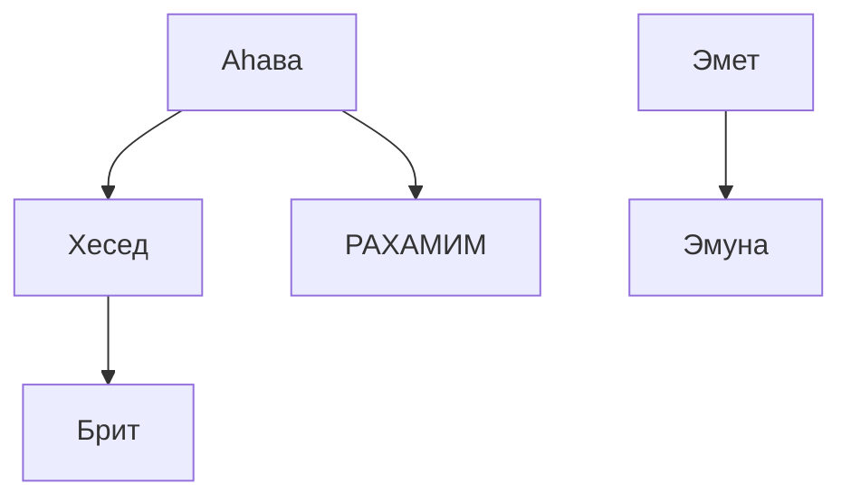
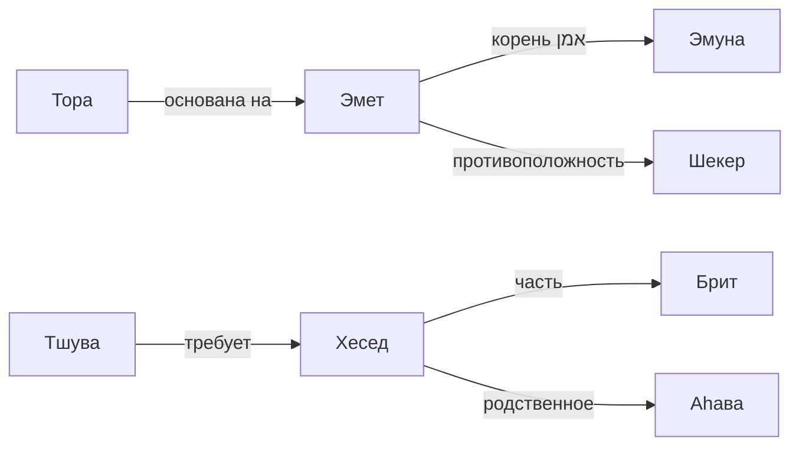

# 📊 ИНСТРУМЕНТ ВИЗУАЛИЗАЦИИ

**Метаданные файла**
- **Файл:** `ideas/visualization-tool.md`
- **Версия:** 1.0
- **Дата создания:** 2026-06-05
- **Последнее обновление:** 2026-06-05
- **Причина обновления:** Первичное создание
- **Статус:** Активный
- **Тема:** Инструмент для визуализации связей между терминами, исследованиями и понятиями
- **Аудит:** bdikah ⏳ | mivdak ⏳ | tikun ⏳ | factcheck ⏳
- **Язык:** русский
- **Хеш:** 02055053
- **Достоверность:** средняя
- **Последний аудит:** 2026-06-09
---

## 🔥 ЧТО ЭТО

Инструмент для создания графических схем связей в репозитории «Голем».

**Зачем нужен:**
- увидеть, как термины связаны между собой
- понять структуру иерархии понятий
- обнаружить пробелы в терминологии
- визуализировать искажения и подмены

---

## 🎯 ТИПЫ ВИЗУАЛИЗАЦИИ

**1. КАРТА ТЕРМИНОВ**
- узлы: термины из `terminology/`
- связи: общие корни, антонимы, синонимы
- цвет: категория термина

**2. ДЕРЕВО КОРНЕЙ**
- корень иврита в центре
- ветви: однокоренные слова
- примеры из ТаНаХа

**3. КАРТА ИССЛЕДОВАНИЙ**
- узлы: исследования из `researches/`
- связи: общие темы, перекрёстные ссылки
- размер узла: количество ссылок

**4. ЦЕПОЧКА ИСКАЖЕНИЙ**
- ивритское слово → греческий → латынь → славянский → русский
- цветом показано, где произошла подмена

**5. ХРОНОЛОГИЯ ПОДМЕН**
- временная шкала: Никейский собор, Септуагинта, Вульгата
- события и их влияние на термины

**6. СТРУКТУРА РЕПОЗИТОРИЯ**
- папки и файлы как узлы
- связи через перекрёстные ссылки
- выявление сирот и центральных файлов

---

## 🛠️ ТЕХНИЧЕСКАЯ РЕАЛИЗАЦИЯ

**ФОРМАТ ВЫВОДА:**
- HTML + JavaScript (интерактивный)
- PNG/SVG (статический)
- JSON (данные для других инструментов)

**БИБЛИОТЕКИ:**
- D3.js — графы и диаграммы
- Vis.js — сетевые графы
- Graphviz — автоматическая раскладка
- Mermaid — простые диаграммы (в md)

**ГЕНЕРАТОР:**
```bash
python3 tools/generate-viz.py --type terms --output viz.html
python3 tools/generate-viz.py --type distortions --output distortions.png
python3 tools/generate-viz.py --type repo --output repo.json
```

---

## 📊 ФОРМАТ ВЫВОДА

**Mermaid (встраивается в md):**
```

```

**Интерактивный HTML:**
- можно перетаскивать узлы
- клик по узлу открывает файл
- поиск и фильтрация
- экспорт в PNG

---

## 🔄 СВЯЗЬ С ДРУГИМИ ИНСТРУМЕНТАМИ

- `add-metadata.py` — добавляет категории терминов
- `find-duplicates.py` — находит пересекающиеся понятия
- `stats-report.py` — статистика для визуализации

---

## 💡 ПРИМЕРЫ

**КАРТА ТЕРМИНОВ (Mermaid):**


**ЦЕПОЧКА ИСКАЖЕНИЙ:**
```
חֶסֶד (хесед)
    ↓ греческий
ἔλεος (элеос) — милость (потеряна верность)
    ↓ латынь
misericordia — жалость (потеряно действие)
    ↓ славянский
милость — чувство (потерян союз)
    ↓ русский
милостыня — подаяние (сужение до благотворительности)
```

**ДЕРЕВО КОРНЯ אהב:**
```
א.ה.ב (аhав — любить)
├── אַהֲבָה (аhава) — любовь
├── אָהוּב (аhув) — возлюбленный
├── אֲהָבִים (аhавим) — любовные отношения
└── אהבון (аhавон) — любовная песнь (поздний иврит)
```

---

## 📋 ПЛАН РАЗРАБОТКИ

**ЭТАП 1: Mermaid-генератор (1 день)**
- скрипт для генерации mermaid-диаграмм
- встраивание в md-файлы

**ЭТАП 2: Карта терминов (2-3 дня)**
- парсинг всех терминов
- извлечение связей (корни, антонимы)
- генерация графа

**ЭТАП 3: Цепочки искажений (2 дня)**
- парсинг `instructions/tahor/`
- построение цепочек для каждого религионима
- визуализация потери смысла

**ЭТАП 4: Интерактивный веб-инструмент (1 неделя)**
- HTML + D3.js
- поиск и фильтрация
- кликабельные узлы

---

## ✅ ПРЕИМУЩЕСТВА

- сложные связи становятся понятными
- легко увидеть пробелы в терминологии
- можно использовать в исследованиях
- привлекательный формат для читателей

---

## ⚠️ СЛОЖНОСТИ

- нужно вручную определять связи между терминами
- большие графы становятся нечитаемыми
- автоматическое извлечение связей сложно

---

## 🛡️ ВОЗВРАЩЕНИЕ

Визуализация — не замена тексту, а дополнение.

Схема показывает структуру, но смысл остаётся в словах.

Путь Яхве — порядок. Порядок виден в связях.

---

הַדֶּרֶךְ יְהוָה — hа-Де́рех Яхве — Путь Яхве
